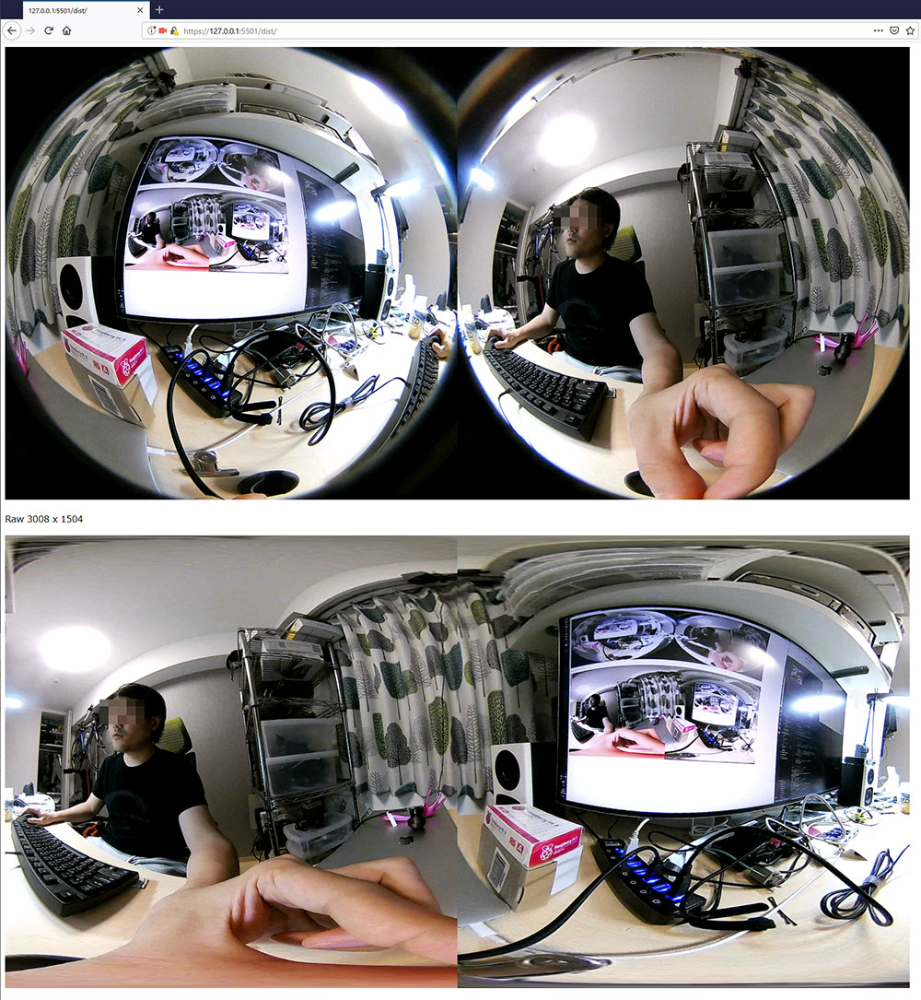

## What is this?



### Equirectangular mapping on WebGL(Three.js).

* [Insta360 Air](https://www.insta360.com/product/insta360-air) is a nice omni-directional camera, which connects to pc directly via usb.
  * lower latency than Ricoh Theta S, Theta V, Ricoh R.
  * hight resolution than Ricoh Theta S, when using live streaming.
  * very small body.
* To see Insta360 Air image in HMD, we need to project the raw double spherical image to equirectangular image. And, In my case, I wanted to steam the video via WebRTC and see it on WebVR on a browser.
  * So, I implemented GLSL Shader to map double spherical raw image of Insta360 Air to Equirectangular.
  * on Three.js.

### TypeScript + WebPack.

* And, for my lesson, I used Webpack and Typescript as development tools.
* Luckily, Three.js officially started to supports typescript.

## Reference

### NEW VERSION

* [Original Article : Converting dual fisheye images into a spherical (equirectangular) projection](http://paulbourke.net/dome/dualfish2sphere/)

### OLD VERSION
* [Original Shader Code](http://stereoarts.jp/) is written by [@Stereoarts](https://twitter.com/Stereoarts). That is originally for Ricoh THETA S and Unity.
* And [@hammmm](https://twitter.com/hammmm) [customed it for Insta360 Air.](http://hammmm.hatenablog.com/entry/2017/06/01/022127)
* My work is translated them to GLSL shader.


## To use

### To Build

```sh
> npm i         # install modules (webpack, typescript and so on.)
> npm run build # webpack
```

### To See the result

* Conect Insta360 Air to your PC.
* Use some webserver.
  * In my case, I use LiveServer on Visual Studio Code.
  * Now, we need to use HTTP**S** webserver to use webrtc.
* And access `https://<Address>:<Port>/dist`

### Stitching Parameters

* dat.GUI on the top-right corner, you can tweek the parameter to stitch.
* press `save` to save the parameters on localStorage.
